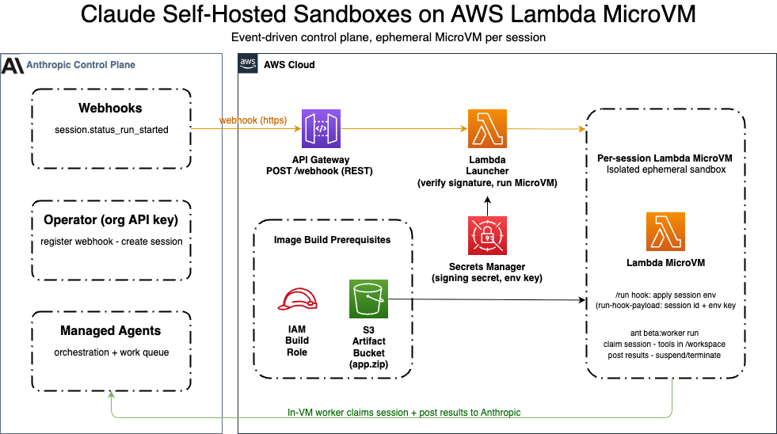

# Claude Self-Hosted Sandboxes on AWS Lambda MicroVMs

A reference solution that runs [Anthropic Claude self-hosted sandbox](https://platform.claude.com/docs/en/managed-agents/self-hosted-sandboxes)
tool execution inside [AWS Lambda MicroVMs](https://docs.aws.amazon.com/lambda/).
It implements the **orchestrator + ephemeral MicroVM per session** pattern: an
event-driven control plane in your AWS account launches a fresh, isolated MicroVM
for each Claude session, while orchestration stays on Anthropic's control plane.

This allows your agents to access resources through your AWS environment without
exposing connectivity, while you retain full monitoring and governance over those
resources.

This is a working reference intended for learning and adaptation.

## What is AWS Lambda MicroVMs?

AWS Lambda MicroVMs is a compute service that provides serverless, ephemeral
execution environments with strong VM-level isolation. Each MicroVM runs Amazon
Linux 2023 with full OS access for up to 8 hours and can be launched, suspended,
resumed, and terminated programmatically. It is purpose-built for running
user-supplied or AI-generated code in isolated sandboxes — this solution uses
one MicroVM per Claude session so sessions never share state.

Key differentiators:

- **Launch from snapshot** — MicroVMs boot from a pre-captured memory and disk
  snapshot, enabling rapid start times by skipping application initialization
  entirely.
- **4× vertical scaling without re-provisioning** — scale a running MicroVM's
  CPU and memory up to 4× its initial allocation without terminating or
  re-creating the compute environment.

## Architecture



The control plane is **event-driven** — there is no poller. The only inbound
traffic is the webhook call; the rest of the workflow is pull-based. The flow:

1. A Claude session reaches the running state and Anthropic sends a
   `session.status_run_started` **webhook** to an Amazon API Gateway endpoint.
2. API Gateway invokes the **launcher Lambda**. The launcher verifies the
   **webhook signature** in-process using the signing secret from SSM Parameter
   Store, denying invalid or stale deliveries.
3. The launcher calls `RunMicrovm` to launch one MicroVM for that session,
   passing the session dispatch via `runHookPayload`. It dedupes on the
   **session id** (DynamoDB-backed, short TTL) so repeat `run_started` webhooks
   for a session in progress don't launch another VM, and stays within the
   RunMicrovm rate limit. See [Session lifecycle](#session-lifecycle-one-microvm-per-session-reused-across-turns).
4. The MicroVM receives the dispatch on its `/run` hook: it fetches the
   environment key from SSM Parameter Store using its own execution role, then
   polls the Anthropic work queue, claiming only work items for **its own**
   session (foreign items are left un-acked for the rightful VM to reclaim),
   executes the agent's tool calls in `/workspace`, posts results back to
   Anthropic, and — when the session goes idle — calls `TerminateMicrovm` on
   itself to release compute. The idle policy is only the fallback if that call
   can't be made.

**Credential boundaries.** The organization-scoped API key is used only by the
operator (registering the webhook, creating sessions) and never reaches AWS
compute. The webhook signing secret lives in AWS Systems Manager Parameter Store
as a SecureString; the **launcher reads only the signing secret** (to verify the
inbound webhook). How the in-VM worker authenticates depends on the
[auth mode](#choosing-an-auth-mode): against the first-party Claude API the
launcher passes only a *reference* (the parameter name) to an environment-key
SecureString that the **MicroVM's execution role alone reads**; on
[Claude Platform on AWS](#claude-platform-on-aws) the worker uses AWS IAM
(SigV4) and no Anthropic secret exists anywhere in the stack. The operator API
key is never placed on any AWS compute.

## Prerequisites

- An AWS account with permissions for S3, IAM, SSM Parameter Store, API Gateway,
  Lambda, WAF, CloudWatch Logs, and AWS Lambda MicroVM.
- AWS CLI v2+ configured with the Lambda MicroVMs service model installed
  (`aws configure add-model`).
- The [AWS SAM CLI](https://docs.aws.amazon.com/serverless-application-model/latest/developerguide/install-sam-cli.html).
- An existing Claude [Managed Agents agent](https://platform.claude.com/docs/en/managed-agents/agent-setup)
  (note its agent ID) and a `self_hosted` environment (note its `env_...` id).
- A webhook signing secret generated in the Claude Console — plus, in
  first-party mode only, an environment key (Claude Platform on AWS uses SigV4
  instead; see [Choosing an auth mode](#choosing-an-auth-mode)).
- `zip` available locally (used to package the MicroVM image source).

## Project Structure

```
.
├── template.yaml                    # SAM template: launcher + REST API, WAF,
│                                    #   MicroVM execution role, image
│                                    #   build role + artifact bucket
├── src/
│   ├── microvm-image/               # Contents zipped into the MicroVM image
│   │   ├── Dockerfile               # AL2023 + Node 22 worker, /workspace, /mnt/session/outputs
│   │   └── worker/worker.mjs        # HTTP lifecycle-hook server (EnvironmentWorker)
│   ├── functions/                   # Launcher Lambda (sam build packages this)
│   │   ├── launcher.py              # Verifies webhook signature; RunMicrovm per session
│   │   ├── requirements.txt         # Launcher deps (anthropic[webhooks], powertools, bundled boto3/botocore)
│   │   ├── shared/                  # Payload, rate limiter, MicroVM client, types
│   │   └── wheels/                  # Vendored boto3/botocore wheels (lambda-microvms client)
│   ├── scripts/
│   │   ├── build-image.sh           # Zip + upload + create/update microvm image
│   │   ├── create-anthropic-access-role.sh  # Cross-account role for Claude Platform on AWS
│   │   └── verify.py                # Operator-side: create a session + start a run
├── docs/                            # Architecture diagram + notes
├── README.md  LICENSE  CONTRIBUTING.md  CODE_OF_CONDUCT.md
└── pyproject.toml  requirements.txt
```

`samconfig.toml` and `.aws-sam/` are generated locally by SAM and are git-ignored.

## Choosing an auth mode

The worker inside each MicroVM can authenticate to Anthropic two ways. Pick one
at deploy time by setting **exactly one** of these stack parameters (the
template rejects deploys with both or neither):

| | First-party Claude API | Claude Platform on AWS |
| --- | --- | --- |
| Anthropic endpoint | `api.anthropic.com` | `aws-external-anthropic.{region}.api.aws` |
| Worker credential | Environment key (bearer), fetched from SSM by reference | AWS IAM SigV4 — no secret on the VM |
| Stack parameter | `EnvironmentKeyParamName` | `AnthropicAwsWorkspaceId` (+ `AnthropicAccessRoleArn` if cross-account) |
| Extra secret to create | Environment key SecureString in SSM | None |

Everything else — webhook, launcher, sessions, verification — is identical in
both modes. For Claude Platform on AWS specifics (subscription, IAM,
cross-account), see [Claude Platform on AWS](#claude-platform-on-aws) below.

## Deployment

The deploy is **one IaC step plus three out-of-band steps**:

1. Deploy the control plane (SAM)
2. Register the webhook and create the SecureString parameters (Console + CLI)
3. Build the MicroVM image (CLI)
4. Verify end-to-end

### 1. Deploy the control plane (SAM)

```bash
sam build
# First-party Claude API mode:
sam deploy --guided --capabilities CAPABILITY_NAMED_IAM \
  --parameter-overrides "AnthropicEnvironmentId=env_... EnvironmentKeyParamName=/claude-microvm-sandbox/anthropic-environment-key"
# — or — Claude Platform on AWS mode:
sam deploy --guided --capabilities CAPABILITY_NAMED_IAM \
  --parameter-overrides "AnthropicEnvironmentId=env_... AnthropicAwsWorkspaceId=wrkspc_..."
```

`--guided` prompts for the stack name and region and writes your answers to
`samconfig.toml` (git-ignored), so subsequent deploys are just `sam build && sam
deploy`. The stack outputs include `WebhookUrl`, `ArtifactBucketName`,
`BuildRoleArn`, and `SigningParamName` (plus `EnvironmentKeyParamName` in
first-party mode).

### 2. Register the webhook and create the SecureString parameters (Console + CLI)

1. **First-party mode only:** in the [Claude Console](https://platform.claude.com/settings/workspaces/default/webhooks),
   generate the **environment key** for your `self_hosted` environment.
2. Register the stack's `WebhookUrl` (from the deploy outputs) as a webhook
   endpoint subscribed to `session.status_run_started`. The Console will provide
   a **webhook signing secret** (`whsec_...`).
3. Create the SSM SecureString parameter(s) using the names from the deploy
   outputs. CloudFormation cannot create `SecureString` parameters, so this is a
   post-deploy step; the stack's IAM roles are already scoped to these names.

```bash
aws ssm put-parameter --type SecureString --name "<SigningParamName>"        --value "<webhook-signing-secret>"
# First-party mode only:
aws ssm put-parameter --type SecureString --name "<EnvironmentKeyParamName>" --value "<environment-key>"
```

To rotate a value later, re-run with `--overwrite`. Both parameters use the
default `alias/aws/ssm` KMS key; pass `--key-id <cmk>` to use a customer-managed
key instead.

### 3. Build the MicroVM image (CLI)

```bash
./src/scripts/build-image.sh
```

The script zips `src/microvm-image/` (excluding local-only artifacts like
`node_modules/` — the Dockerfile runs its own `npm install`), uploads to S3,
and **creates the image, or updates it in place if one with the same name
already exists** (re-run it to ship worker changes). Monitor the build in
CloudWatch under `/aws/lambda/microvms/<image-name>`; the image transitions to
`CREATED` (or `UPDATED`) on success. Pass `WORKER_DEBUG=1` to bake in verbose
logging — see [Worker debug mode](#worker-debug-mode).

### 4. Verify (operator-side)

```bash
export ANTHROPIC_API_KEY="sk-ant-..."          # organization-scoped, operator only
export ANTHROPIC_ENVIRONMENT_ID="env_..."
export AGENT_ID="agent_..."
python src/scripts/verify.py --create
```

This creates a session, triggers the webhook, launches a MicroVM, and runs the
agent end-to-end. Confirm with `aws lambda-microvms list-microvms` /
`get-microvm`.

## Claude Platform on AWS

[Claude Platform on AWS](https://platform.claude.com/docs/en/build-with-claude/claude-platform-on-aws)
serves the Claude API through an AWS gateway
(`aws-external-anthropic.{region}.api.aws`) with AWS-native authentication.
**Environment keys don't exist on this platform** — the self-hosted worker
authenticates with AWS IAM (SigV4), so no Anthropic secret is ever placed on
the VM. Follow these steps to run this sample against it.

### 1. Subscribe and collect identifiers

1. Complete Claude Platform on AWS sign-up from its AWS Console service page.
   This provisions an Anthropic organization tied to that AWS account (the
   *subscribed account*). Resources from a first-party Anthropic org (agents,
   environments, keys) don't carry over — create them in the new org.
2. Create a workspace and note its id (`wrkspc_...`) from **Workspaces** on the
   service page or in the Claude Console.
3. Create the agent and `self_hosted` environment in this org, and note the
   `env_...` and `agent_...` ids.
4. Register the webhook (step 2 of [Deployment](#deployment)) in *this org's*
   Console.

### 2. Wire up IAM

**Same account** (the stack deploys into the subscribed account): nothing to
do — the template attaches the AWS-managed
`AnthropicSelfHostedEnvironmentAccess` policy plus the required
`sts:GetWebIdentityToken`/`sts:TagGetWebIdentityToken` grants to the MicroVM
execution role automatically.

**Cross-account** (the stack runs in a different account than the
subscription): create a role in the *subscribed* account that the MicroVM
execution role can assume:

```bash
AWS_PROFILE=<subscribed-account> \
SUBSCRIBED_ACCOUNT_ID=<subscribed-account-id> \
COMPUTE_ACCOUNT_ID=<stack-account-id> \
./src/scripts/create-anthropic-access-role.sh
```

The script is idempotent; it creates the role with a trust policy scoped to the
MicroVM execution role, attaches `AnthropicSelfHostedEnvironmentAccess`, and
adds the `sts:GetWebIdentityToken`/`sts:TagGetWebIdentityToken` inline grant
(the gateway exchanges the SigV4 identity for a web-identity token; the managed
policy doesn't cover these). Note the printed role ARN.

### 3. Deploy in AWS mode

```bash
sam deploy --capabilities CAPABILITY_NAMED_IAM --parameter-overrides \
  "AnthropicEnvironmentId=env_... AnthropicAwsWorkspaceId=wrkspc_... AnthropicAccessRoleArn=arn:aws:iam::<subscribed-account>:role/claude-microvm-anthropic-access"
```

Omit `AnthropicAccessRoleArn` in the same-account case. Then build the MicroVM
image and register the webhook as in [Deployment](#deployment) — the only SSM
secret needed is the webhook signing secret.

### 4. Verify

Use the operator flow from [Verify](#4-verify-operator-side) with the
AWS-brokered key (`ANTHROPIC_AWS_API_KEY` + `ANTHROPIC_AWS_WORKSPACE_ID`). In
the worker logs (`/aws/lambda/microvms/<image-name>`) you should see
`worker: auth mode = SigV4 (Claude Platform on AWS...)` followed by
`worker: handling session ...`.

## Configuration

Launcher Lambda environment (set by the SAM template):

| Variable | Description |
| --- | --- |
| `ANTHROPIC_ENVIRONMENT_ID` | The self-hosted environment id. |
| `MICROVM_IMAGE_IDENTIFIER` | Name, ID, or ARN of the built MicroVM image. |
| `SIGNING_PARAM_NAME` | SSM SecureString parameter name of the webhook signing secret (used to verify inbound webhooks). |
| `ENVIRONMENT_KEY_PARAM_NAME` (first-party mode) | SSM SecureString parameter name of the environment key. Passed by *reference* into the MicroVM; the launcher does not read its value. |
| `ANTHROPIC_AWS_WORKSPACE_ID` (AWS mode) | Claude Platform on AWS workspace id, forwarded to the worker for the `anthropic-workspace-id` header. |
| `ANTHROPIC_ACCESS_ROLE_ARN` (AWS mode, cross-account) | Role in the subscribed account the worker assumes before SigV4-signing gateway requests. |
| `MICROVM_EXECUTION_ROLE_ARN` | Execution role assigned to each MicroVM. |
| `ANTHROPIC_BASE_URL` (optional) | Override the default Claude API endpoint. |

The operator API key is **operator-only** and is never placed on any AWS
compute.

### Session lifecycle: one MicroVM per session, reused across turns

Every agent turn emits a `session.status_run_started` webhook, so naive
per-event handling would launch one VM per turn. Instead:

- The **launcher dedupes on session id** (DynamoDB idempotency,
  `SESSION_DEDUPE_TTL_SECONDS = 300`): within the TTL, repeat webhooks for the
  same session don't launch again.
- The **worker keeps serving the session**: after completing a turn it keeps
  polling for the session's next work item and exits only after
  `WORK_IDLE_EXIT_MS` (default 360 000 ms) of idleness. This also absorbs the
  startup race where the webhook arrives before the work item is claimable.
- The **VM idle policy** (`maxIdleDurationSeconds: 420`,
  `suspendedDurationSeconds: 0`, `autoResumeEnabled: false`) is a backstop
  above the worker's self-exit; per-session VMs terminate rather than suspend.

The invariant that makes this gap-free: worker idle window (360 s) **>**
dedupe TTL (300 s). A turn inside the TTL is served by the live VM; a turn
after it launches a fresh VM. Worst case is a redundant launch that finds no
work and idle-exits — never a dropped turn. A multi-turn conversation with
< 5-minute gaps costs one VM; an abandoned session self-terminates in ~6–7
minutes.

### Worker debug mode

Set `WORKER_DEBUG=1` in the MicroVM image's environment variables to log, to
the image's CloudWatch log group, everything flowing into the VM:

- every lifecycle-hook request and body, plus the raw `/run` envelope and the
  parsed dispatch (session/env/region);
- each work-poll cycle — items seen, whether each matches this VM's session,
  foreign items left for reclaim, empty drains, and poll/ack errors (this is
  how the cross-session starvation bug below was diagnosed);
- every tool call the agent executes — tool name and full input (e.g. the exact
  bash command) plus a 400-character result preview.

Enable it at build time with `WORKER_DEBUG=1 ./src/scripts/build-image.sh`, or
directly via `update-microvm-image --environment-variables '{"WORKER_DEBUG":"1"}'`.
Off by default: the logged payloads and tool inputs/outputs may contain
sensitive data — turn it back off (rebuild without the variable) once done.
`WORK_IDLE_EXIT_MS` can be tuned the same way.

The MicroVM image installs **Node.js 22** (`nodejs22` on AL2023) — the
Anthropic TypeScript SDK requires Node >= 22, and the Dockerfile fails the
build if an older version ends up on `PATH`.

## Troubleshooting

| Symptom | Likely cause / fix |
| --- | --- |
| Webhook returns 401 | Signature verification failed in the launcher. Confirm the signing secret in SSM Parameter Store matches the Console, and that the delivery is fresh. |
| No MicroVM launches | Check the launcher logs; confirm the webhook is registered for `session.status_run_started` and the image identifier is correct. Also confirm the session actually started a run — a session left `idle` never fires the webhook (`verify.py --create` starts one). |
| Launcher logs `ignoring non-start event type=event` | The event kind lives in `data.type` (e.g. `session.status_run_started`); the top-level `type` is always the literal `event`. Parse the kind from `data["type"]`. |
| Launcher `KeyError` on an env var (e.g. `ANTHROPIC_ENVIRONMENT_ID`) | The function's environment was changed out-of-band (e.g. `update-function-configuration`), causing CloudFormation drift the template can't self-heal. Redeploy with a changed `Environment` block (bump `CACHE_BUST`) to force CFN to rewrite it, and keep all env changes in the template. |
| One VM launched per agent turn | The launcher dedupes on **session id** for `SESSION_DEDUPE_TTL_SECONDS`; if you see per-turn launches, confirm the idempotency table is configured (`IDEMPOTENCY_TABLE`) and the worker's `WORK_IDLE_EXIT_MS` exceeds the dedupe TTL. |
| Second run of a session hangs in the Console | The worker must outlive the dedupe window and keep polling (`WORK_IDLE_EXIT_MS`). On older images the worker exited after one drain pass, so a turn arriving later found no worker; rebuild the image. A session stuck `waiting on responses` from a dead VM needs a `user.interrupt` before it accepts new messages. |
| Session hangs with the VM alive but idle (worker logs poll cycles finding no work while another session runs) | Cross-session work-item theft: a VM must claim (`ack`) only its own session's items and leave foreign items un-acked for the rightful VM to reclaim. A worker that claims-then-skips a foreign item strands it and starves the other session. Fixed in current images (raw poll + selective ack); rebuild if you see this. `WORKER_DEBUG=1` shows `poll.foreign` / `poll.item` lines that confirm it. |
| Image build fails `S3_*` | Build role/bucket issue. Confirm the artifact is in the same region, not in Glacier, and the Build role grants `s3:GetObject`. |
| Image build fails `ARCHIVE_DOCKERFILE_NOT_FOUND` | Dockerfile must be at the root of `app.zip`; `build-image.sh` zips from inside `microvm-image/`. |
| Worker 401 `Invalid bearer token` (AWS mode) | The worker sent a bearer credential to the AWS gateway — environment keys don't work there. Deploy with `AnthropicAwsWorkspaceId` (not `EnvironmentKeyParamName`) and rebuild the image. |
| Worker `Your account has not subscribed to this service yet` | The SigV4 identity belongs to an AWS account without a Claude Platform on AWS subscription. Use the cross-account role (`AnthropicAccessRoleArn`) or deploy into the subscribed account. |
| Worker `AccessDenied ... sts:AssumeRole` (cross-account) | Trust policy on the access role doesn't match the MicroVM execution role ARN, or the role name differs from the deployed `AnthropicAccessRoleArn`. Re-run `create-anthropic-access-role.sh`. |
| Worker 403 `sts:GetWebIdentityToken` / `sts:TagGetWebIdentityToken` | The role the worker signs as is missing those STS grants (the Anthropic managed policy doesn't include them). Re-run `create-anthropic-access-role.sh`, or redeploy (same-account mode adds them automatically). |

## Cost

Costs are driven primarily by MicroVM run time (per AWS Lambda MicroVMs pricing),
plus standard API Gateway, Lambda, SSM Parameter Store, and S3 usage. Because each
session runs in its own MicroVM that is suspended/terminated at session end, cost
scales with concurrent sessions and their duration. Monitor with AWS Cost Explorer.

## Security

- The operator API key never reaches AWS compute or a MicroVM; the dispatch
  payload carries only the per-session id and non-secret auth-mode fields (an
  SSM parameter *name* in first-party mode; a workspace id / role ARN in AWS
  mode).
- On Claude Platform on AWS no Anthropic secret exists anywhere in the stack —
  the worker authenticates with short-lived SigV4 credentials from the VM's
  execution role (optionally via a scoped cross-account assume-role).
- The webhook is authenticated by signature verification in the launcher Lambda;
  invalid or stale deliveries are denied (401) before any MicroVM is launched.
- Secrets live in AWS Systems Manager Parameter Store as SecureString parameters
  with least-privilege access (launcher → signing secret only; in first-party
  mode, MicroVM execution role → environment key only). Each role's
  `kms:Decrypt` is bounded to its own parameter via the `PARAMETER_ARN`
  encryption context.
- Each session runs in its own isolated MicroVM. The worker self-terminates
  (`lambda:TerminateMicrovm`, granted on the execution role) when the session
  ends; the idle policy is the fallback and the 8-hour maximum duration bounds
  any VM.
- The S3 artifact bucket blocks public access and enables versioning and
  server-side encryption.
- The public webhook endpoint sits behind an AWS WAF WebACL (AWS managed rule
  sets plus a per-IP rate limit) and API Gateway request validation, which reject
  malformed and abusive traffic before it reaches the launcher. These are
  defense-in-depth: the webhook signature check remains the authentication.

## License

This library is licensed under the MIT-0 License. See the [LICENSE](LICENSE) file.
